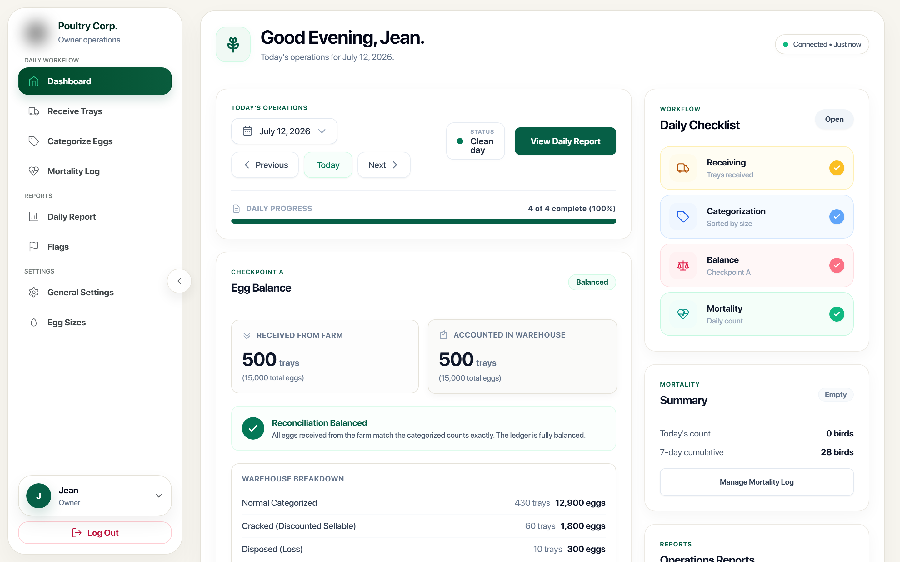

# Corporate Egg Production and Delivery Business

> **Poultry Farm Operations Monitoring & Reconciliation System.**
> Confidential client project · Live in production.

---

> **Note on Confidentiality.** This project was built under a confidentiality agreement with a private corporate client. The client name, branding, internal business rules, deployment specifics, and source code are **intentionally omitted**. What follows is a **generalized system overview** approved for portfolio demonstration only.

## System Overview

A centralized web-based **Poultry Farm Operations Monitoring & Reconciliation System** designed to digitize, streamline, and audit the daily operations of a corporate egg production business. The system acts as an owner-side control panel, tracking daily egg collection, receiving, warehouse sorting/categorization, and daily flock mortality, while automatically detecting inventory or data anomalies.

The platform replaced manual paper logbooks and disconnected spreadsheets with a real-time digital solution, deployed on a centralized environment for a corporate agribusiness operator.

## Goal

The primary goal was to **replace manual, error-prone spreadsheets** with a secure, reliable, real-time digital validation platform.

Key objectives:
- **Ledger Balancing** — Eliminate manual spreadsheets by recording daily farm deliveries and warehouse categorizations to instantly check for leaks or count mismatches.
- **Anomalies Detection (Flag Engine)** — Automatically raise flags for discrepancies like delivery count variance (missing or excess eggs) and excessive disposal rates based on configurable thresholds.
- **Flock Health Tracking** — Log daily mortality events to monitor overall flock wellness.
- **Actionable Intelligence** — Provide the owner with a single-screen operational dashboard, detailed daily reconciliation reports, and monthly CSV exports.

## System Modules

The application provides a unified dashboard and modules scoped for owner reconciliation:

### 1. Reconciliation Dashboard
- **Single-Screen Operations Check** — Instant review of today's workflow progress, bird mortality, and active high-severity flags.
- **Date Navigation** — Move day-by-day to audit past logs, track state, and manage open flags.
- **Connection Health** — Visual indicator of local connectivity, optimized for rural internet resilience.

### 2. Daily Receivings & Categorizations
- **Farm Delivery Logging** — Record total trays received from farm operations for any selected business date.
- **Warehouse Sorting** — Categorize received eggs by size/grade (Pewee, Pullets, Small, Medium, Large, Extra Large, Jumbo) and record cracked trays.
- **Protected Disposal Class** — Log unsellable eggs as disposed, keeping them strictly separated from inventory rolls.
- **Save-State Security** — Reusable form components with explicit `Saving... / Saved / Failed` states to survive weak rural connections.

### 3. Flag Engine
- **Checkpoint A Validation** — Instant verification that delivered eggs equal categorized + cracked + disposed eggs.
- **Anomalies & Discrepancies** — Triggers flags for **Delivery Count Variance** (missing or excess eggs) and **Excessive Disposal Rates** based on configurable settings thresholds.
- **Frozen History** — Stores flag impacts as immutable snapshots to maintain historical audit trail integrity.

### 4. Mortality Logging & Reports
- **Mortality Log** — Keep chronological counts of daily poultry mortality.
- **Daily Reconciliation Report** — Single-day breakdown of all operational logs, flag summaries, and unit details.
- **Settings Configuration** — Manage global constants like `eggs_per_tray` (silently converting physical trays to accounting eggs) and flag thresholds.

## How It Helps

By integrating all facets of poultry farm management into a single platform, the system **significantly reduces administrative overhead**:

- **Owners** monitor farm health and ledger balances in real time from a single view.
- **Data operators** enter logs efficiently, knowing the system handles tray-to-egg conversions automatically.
- **The business** maintains strict inventory control via automatic discrepancy checks.
- **Net result** — minimized waste, immediate discrepancy visibility, and increased operational confidence.

## Documentation

| Document | Description |
|----------|-------------|
| [Case Study](./docs/case-study.md) | Narrative-style write-up: client need → solution → outcome |
| [Engineering Challenges](./docs/challenges.md) | Selected hard problems and how they were solved |
| [Deployment](./docs/deployment.md) | Infrastructure and operational notes (sanitized) |
| [Scalability](./docs/scalability.md) | Scaling and performance considerations |
| [Tech Stack](./tech-stack.md) | Detailed stack breakdown with rationale |

## Visual Artifacts

The system's interface captures (sanitized: client branding and real production data redacted):

- [Login Page](./screenshots/login_page.png)
- [Dashboard (Balanced/Clean State)](./screenshots/dashboard_clean.png)
- [Dashboard (Missing Eggs Discrepancy)](./screenshots/dashboard_discrepancy.png)
- [Dashboard (Excessive Disposal Warning)](./screenshots/dashboard_disposal_flag.png)
- [Daily Receivings Log](./screenshots/receivings_index.png)
- [Create Daily Receiving](./screenshots/receivings_create.png)
- [Egg Categorization Form](./screenshots/categorizations_create.png)
- [Mortality Logs](./screenshots/mortality_logs.png)
- [Flags Overview](./screenshots/flags_index.png)
- [Daily Reconciliation Report](./screenshots/daily_report.png)
- [Settings & Thresholds](./screenshots/settings_index.png)

---

© 2026 Mark Anthony Resoso · See [LICENSE](../../LICENSE) · Provided for portfolio demonstration only. No confidential client information is disclosed.
