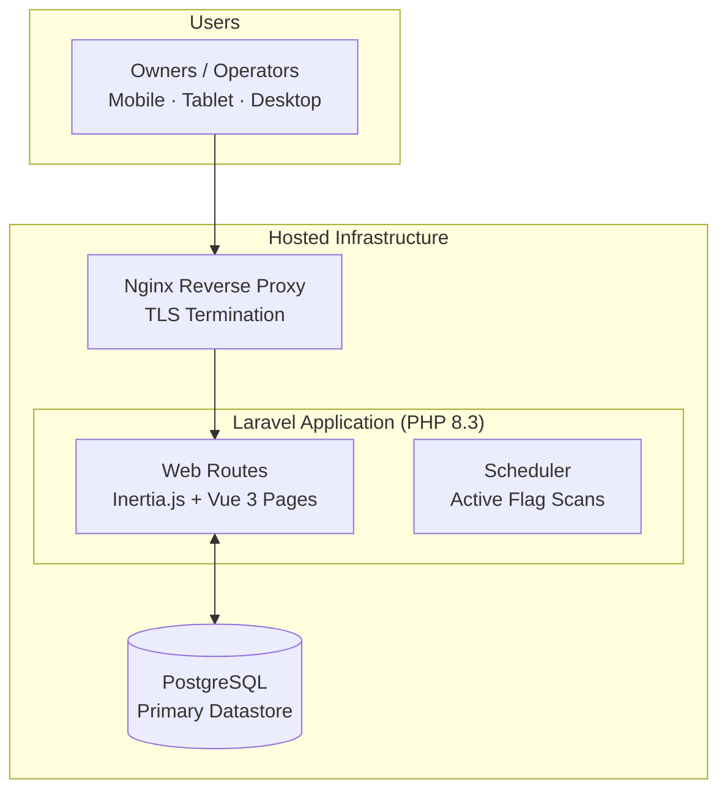
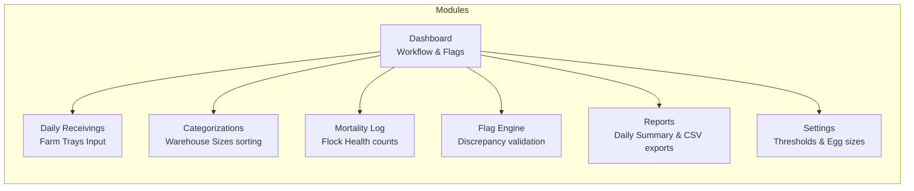
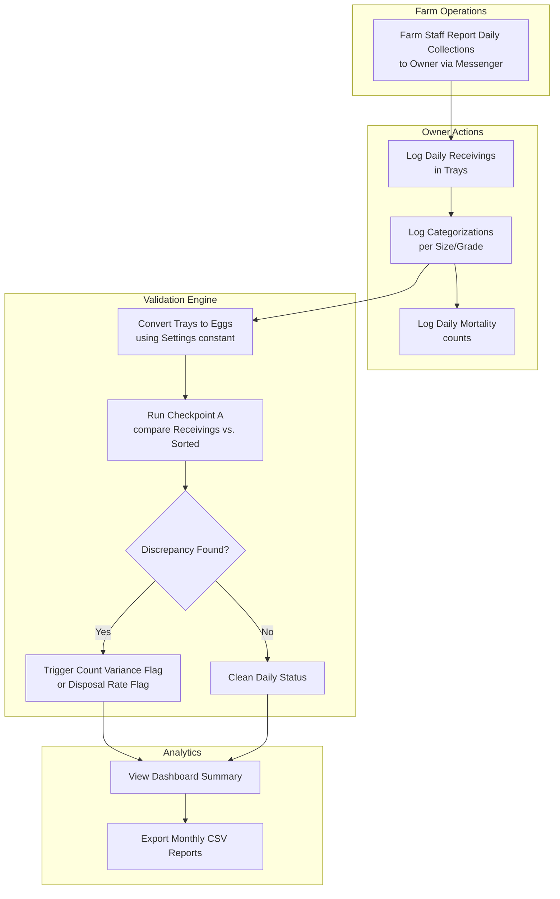
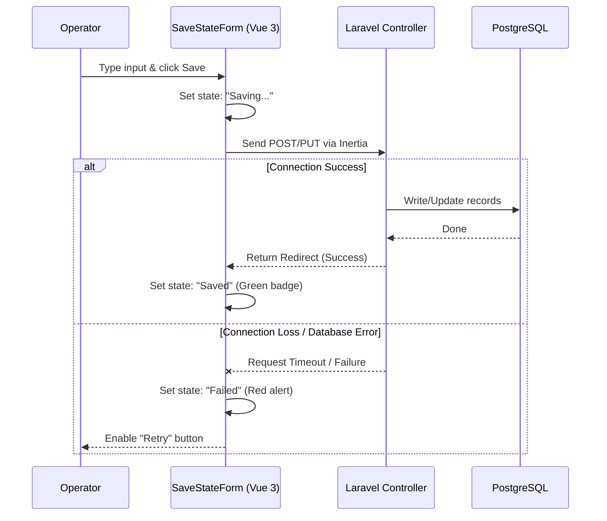

# Corporate Egg Production & Delivery Business — System Architecture

> A high-level architectural overview of the poultry farm operations monitoring and reconciliation system.
> Client identity, branding, and proprietary business rules are intentionally omitted.
> Diagrams render natively on GitHub via Mermaid.

---

## 1. System Overview

This system is a **centralized web application** built on the **Laravel + Inertia.js + Vue 3** stack. The application acts as a single-tenant administrative dashboard. All operators connect to the same central database, ensuring real-time balancing of farm deliveries and sorting metrics, with built-in resilience for weak rural internet connections.



---

## 2. Operational Modules

Since all authenticated accounts share administrative reconciliation access, the system modules are organized around the daily audit workflow:



---

## 3. Core Operational Flow — Farm to Reconciliation

The daily workflow uses the **Asia/Manila business date** as its primary scope. Data operators log daily farm collections and warehouse sorting counts. The system then automatically converts trays to eggs and reconciles the counts via **Checkpoint A**:



---

## 4. Save-State Form Architecture

To prevent data loss on weak rural internet connections, all data-entry forms implement a **Save-State design pattern**. Operations are executed through Inertia.js with explicit visual states:



---

## 5. Entity Relationship Diagram (ERD)

The database schema is structured for strict validation and data integrity:

```mermaid
erDiagram
    users {
        bigint id PK
        string name
        string email
        string password
        timestamp email_verified_at
        timestamp created_at
        timestamp updated_at
    }
    egg_sizes {
        bigint id PK
        string slug
        string name
        int display_order
        boolean is_disposal
        timestamp created_at
        timestamp updated_at
    }
    settings {
        bigint id PK
        string key UNIQUE
        string value
        string label
        string group
        string type
        timestamp created_at
        timestamp updated_at
    }
    daily_receivings {
        bigint id PK
        date date UNIQUE
        int received_trays
        int eggs_per_tray_snapshot
        text source_notes
        bigint user_id FK
        timestamp deleted_at
        timestamp created_at
        timestamp updated_at
    }
    mortality_logs {
        bigint id PK
        date date UNIQUE
        int count
        text notes
        bigint user_id FK
        timestamp deleted_at
        timestamp created_at
        timestamp updated_at
    }
    categorizations {
        bigint id PK
        date date
        bigint egg_size_id FK
        int trays
        int eggs_per_tray_snapshot
        bigint user_id FK
        timestamp deleted_at
        timestamp created_at
        timestamp updated_at
    }
    flags {
        bigint id PK
        date date
        string type
        string severity
        string status
        string flagable_type
        bigint flagable_id
        text message
        decimal impact_quantity
        string impact_unit
        json calculation_snapshot
        json metadata
        text investigation_notes
        bigint resolved_by FK
        timestamp resolved_at
        timestamp superseded_at
        bigint user_id FK
        timestamp created_at
        timestamp updated_at
    }

    users ||--o{ daily_receivings : "creates"
    users ||--o{ mortality_logs : "creates"
    users ||--o{ categorizations : "creates"
    users ||--o{ flags : "creates/resolves"
    egg_sizes ||--o{ categorizations : "categorizes into"
```

---

## 6. Key Architectural Decisions

| Decision | Rationale |
|---|---|
| **Centralized single-tenant deployment** | Deployed as a single tenant serving trusted operators. Avoids tenant complexity while maintaining high performance. |
| **Asia/Manila business date** | All operational records use the Manila business calendar date, not `created_at`. This aligns the digital ledger with real-world farm collection periods. |
| **Unit conversion at the egg level** | The user inputs all counts in physical trays (whole units). The system converts trays → eggs internally using `eggs_per_tray` to allow fractional losses and disposal sorting. |
| **Settings snapshotting** | To ensure data integrity, settings parameters like `eggs_per_tray_snapshot` are copied directly to the `daily_receivings` and `categorizations` tables at the moment of saving. |
| **Frozen Flag Snapshots** | Active flags freeze the variables and thresholds used during calculation inside `flags.calculation_snapshot`. This prevents old flags from changing their values if settings thresholds are adjusted later. |
| **Check constraints** | PostgreSQL table constraints enforce that quantities like `received_trays`, `trays` (sorting), and `count` (mortality) are strictly non-negative. |

---

<sub>© 2026 Mark Anthony Resoso · [Back to project](../README.md) · Provided for portfolio demonstration only. No confidential client information is disclosed.</sub>
