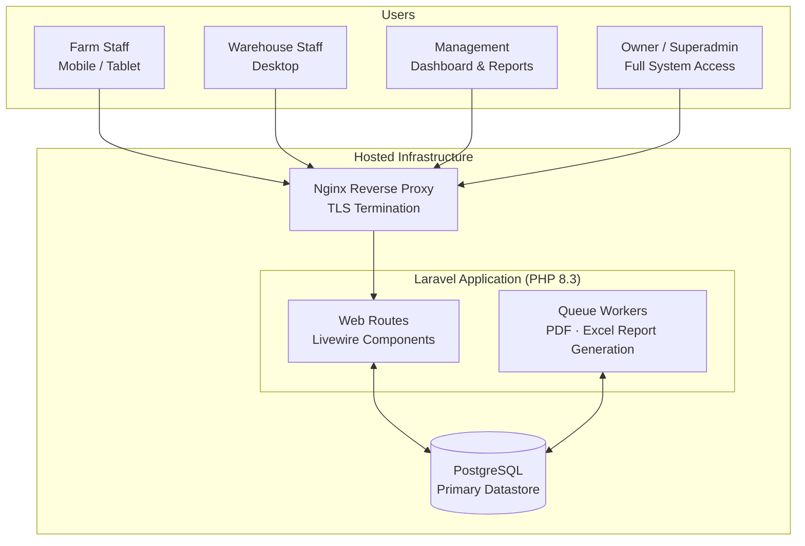
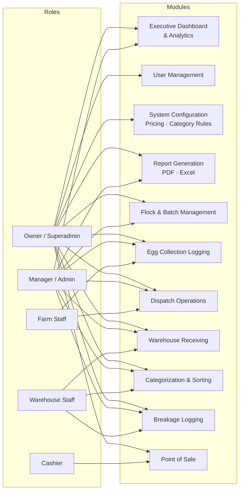
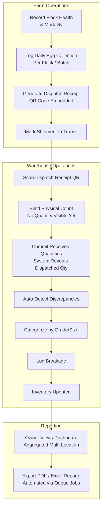
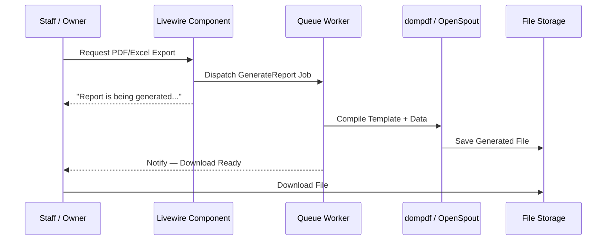
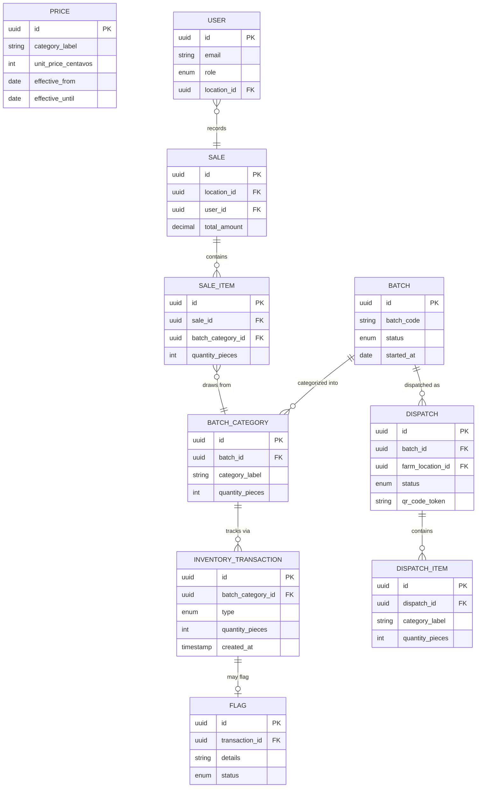

# Corporate Egg Production & Delivery Business — System Architecture

> A high-level architectural overview of the poultry farm management and distribution system.
> Client identity, branding, and proprietary business rules are intentionally omitted.
> Diagrams render natively on GitHub via Mermaid.

---

## 1. System Overview

This system is a **centralized, multi-location web application** built on the TALL stack (Tailwind, Alpine, Laravel, Livewire). Rather than deploying separate instances per location, a single application instance serves all physical sites — farms, warehouse, and sales points — with access scoped strictly by user role and location assignment at the application layer.

---

## 2. Role-Based Access & Module Visibility

Each operational tier interacts only with the modules relevant to their responsibilities. Access is enforced at both the routing layer and the application policy layer.

---

## 3. Core Operational Flow — Farm to Warehouse

The system enforces a **paired dispatch / receive model** with explicit inventory state transitions. A key control: warehouse staff perform **blind receiving** — they physically count and categorize an incoming delivery without prior knowledge of the dispatched quantity, ensuring maximum inventory accuracy.

---

## 4. Document Generation Architecture

Dispatch receipts and operational reports are generated **server-side via queue jobs** — no client-side document assembly. This keeps generation off the request cycle and allows large multi-year exports without timeout risk.

---

## 5. Entity Relationship (High-Level)

---

## 6. Key Architectural Decisions

| Decision | Rationale |
|---|---|
| **Centralized single deployment** | All locations share one application instance with role + location scoping enforced at the application layer — no per-site deployments to maintain. |
| **Blind receiving discipline** | Server hides dispatched quantities until warehouse staff commit their physical count. Eliminates confirmation bias and ensures true independent verification. |
| **Append-only transactional tables** | Core transactional records (`BatchCategory`, `InventoryTransaction`, `SaleItem`) are immutable after creation. Corrections are made via new compensating records, not edits — preserving a complete audit trail. |
| **Integer centavos for money** | All monetary values stored as integers (centavos). No floating-point arithmetic near financial data. |
| **Integer pieces for quantities** | All egg quantities stored as integer pieces. Display layer converts to tray + piece format as needed. |
| **UUID primary keys** | All domain tables use UUID v4 PKs, preventing enumerable ID attacks and supporting future distributed scenarios. |
| **Queue-dispatched document generation** | PDF and Excel generation is always handled by background workers — never on the HTTP request cycle. |

---

© 2026 Mark Anthony Resoso · [Back to project](../README.md) · Provided for portfolio demonstration only. No confidential client information is disclosed.
