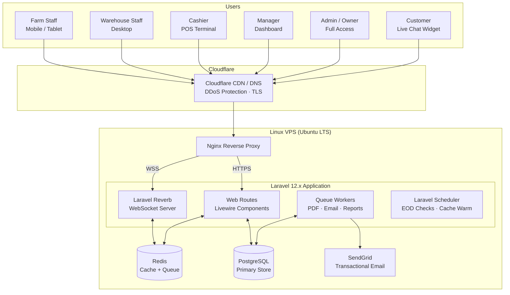
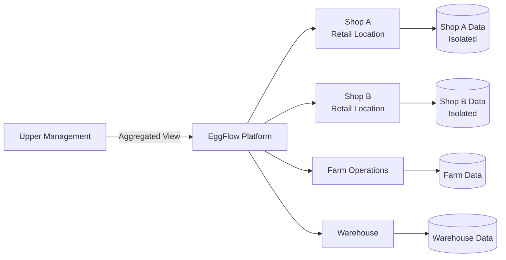
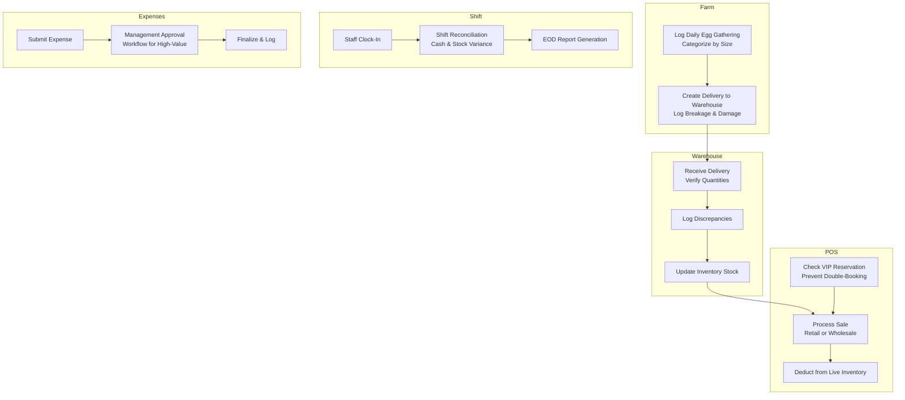
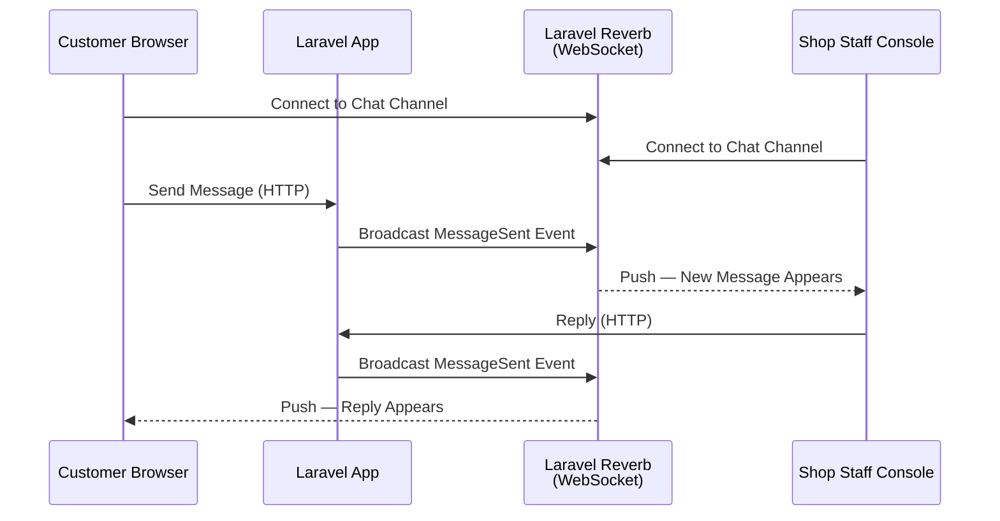
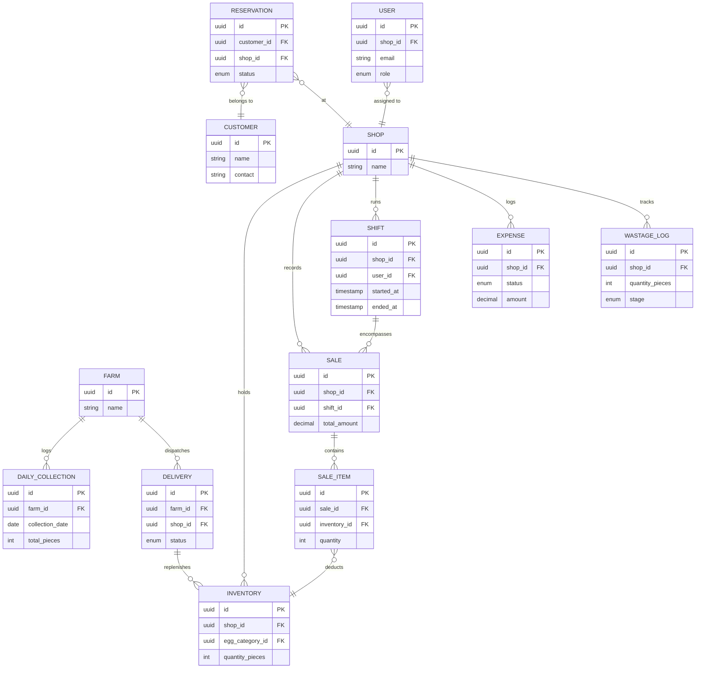

# EggFlow — System Architecture

> A high-level architectural overview of the EggFlow agribusiness management platform.
> Diagrams are written in Mermaid and render natively on GitHub.

---

## 1. System Overview

EggFlow is a **multi-tenant TALL stack application** (Tailwind, Alpine, Laravel, Livewire) purpose-built for agribusinesses managing egg production end-to-end — from daily farm collection through warehouse processing to retail sale. Each shop operates in strict data isolation, while upper management can aggregate across locations.

Real-time features (live chat, POS inventory sync) run through **Laravel Reverb** (self-hosted WebSockets). **Redis** backs both the cache layer (dashboard aggregates) and the async job queue (document generation, email delivery).

---

## 2. Multi-Tenant Shop Isolation

---

## 3. Core Operational Flow

---

## 4. Real-Time Communications

---

## 5. Entity Relationship (High-Level)

---

## 6. Key Architectural Decisions

| Decision | Rationale |
|---|---|
| **TALL Stack (no decoupled SPA)** | All critical state (inventory levels, shift state, approval status) lives server-side. Livewire eliminates a serialization boundary without sacrificing reactivity. |
| **Redis for Cache + Queue** | Dashboard aggregates are expensive to compute; Redis caches them between invalidations. The same Redis instance backs async job queues for PDF and email generation. |
| **Expense Approval Workflow** | High-value operational costs route through management before finalization, creating an auditable approval trail. |
| **Shift Reconciliation** | Staff clock-in establishes a baseline; on close, actual cash and stock are compared to expected values. Discrepancies are flagged automatically. |
| **VIP Reservation Sync** | Reservations lock inventory at a record level, preventing POS from double-booking reserved stock in real time. |
| **Audit Logging (OwenIt)** | Every state-changing action captures before/after values with actor attribution — essential for discrepancy investigation. |

---

© 2026 Mark Anthony Resoso · [Back to project](../README.md) · For portfolio demonstration only.
