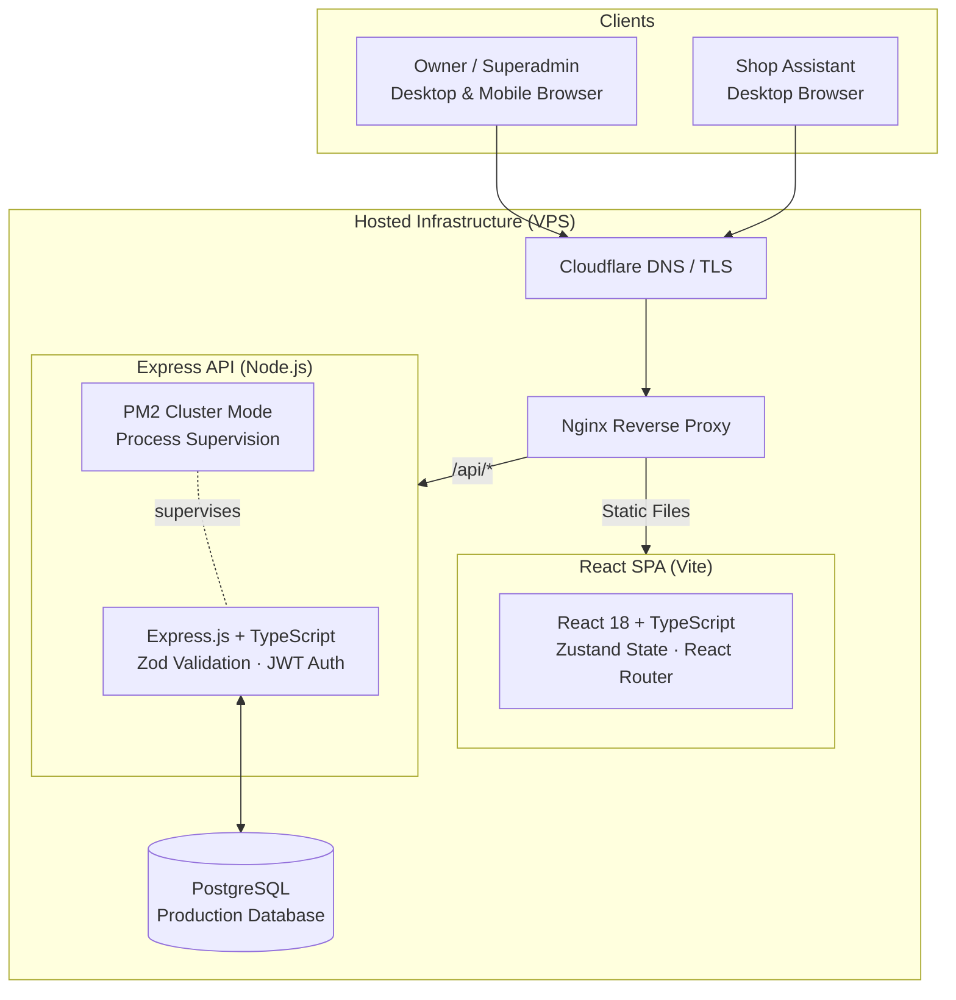
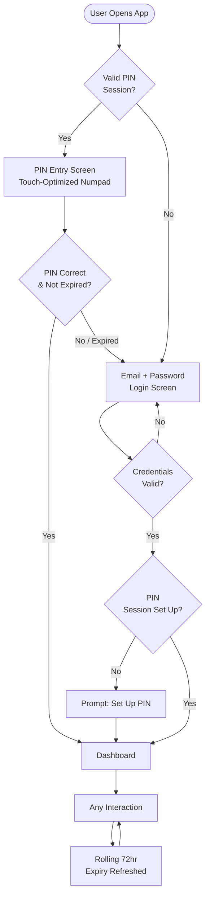
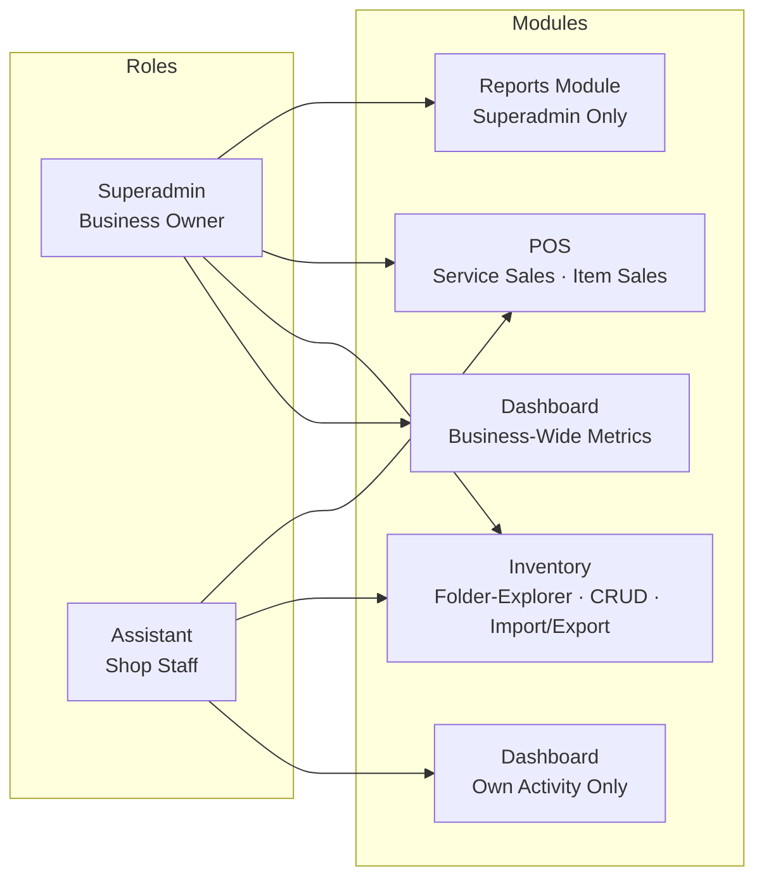
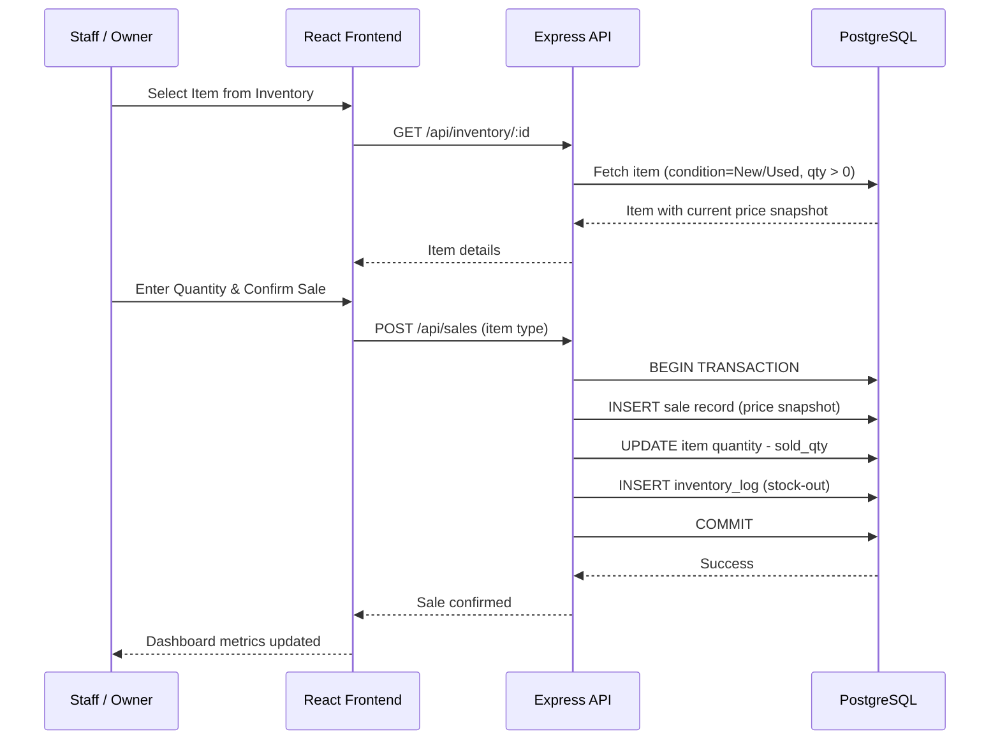
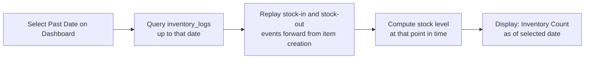
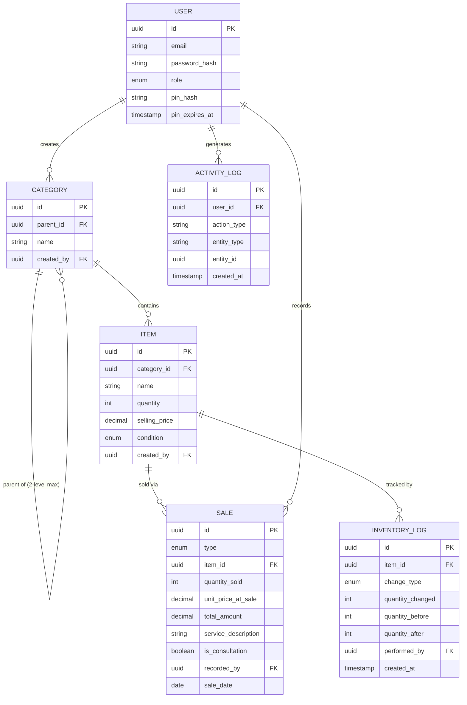
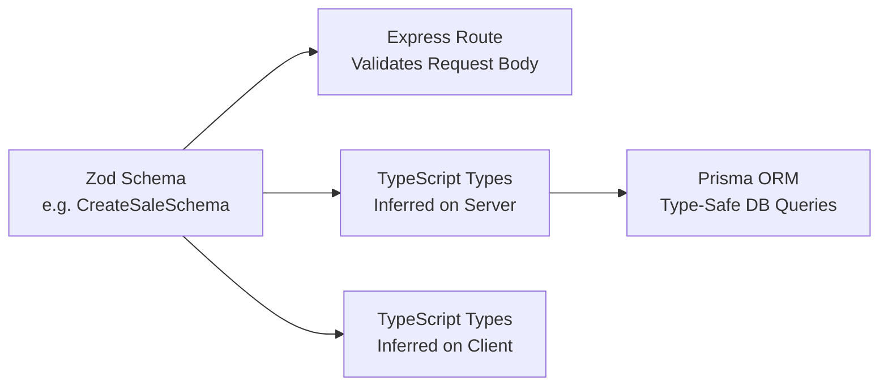

# Local Computer Retail Business — System Architecture

> A high-level architectural overview of the POS, inventory, and service-log platform.
> Client identity, branding, and proprietary business details are intentionally omitted.
> Diagrams render natively on GitHub via Mermaid.

---

## 1. System Overview

This system uses a **decoupled architecture** — a React SPA frontend communicates with a strictly typed Express/Node.js REST API backend. TypeScript is used end-to-end on both the client and server, with **Zod schemas** as the single source of truth for request validation, inferring TypeScript types consumed by the frontend. Prisma manages the database schema and generates type-safe query clients.

---

## 2. Authentication & Session Architecture

The system implements a **dual-mode authentication** strategy: standard email/password login for first access, and a **4-digit PIN with a rolling 72-hour session** for fast repeat access — optimized for the owner's on-the-go mobile usage.

---

## 3. Module Structure & Role Access

---

## 4. Core Data Flows

### 4a. Item Sale Flow

### 4b. Historical Inventory Calculation

---

## 5. Entity Relationship (High-Level)

---

## 6. End-to-End Type Safety

A key engineering decision is using **Zod as the single source of type truth** across the entire stack. This eliminates an entire class of runtime type mismatch bugs between the frontend and backend.

---

## 7. Key Architectural Decisions

| Decision | Rationale |
|---|---|
| **Decoupled React SPA + REST API** | The owner accesses the system primarily from a mobile browser on-the-go. A separate frontend allows the React layer to be fully optimized for responsive, touch-first interactions independent of server rendering. |
| **End-to-end TypeScript + Zod** | Zod schemas validate incoming requests and simultaneously infer TypeScript types used on both server and client — one definition, zero duplication. |
| **Ownership-based permissions** | Every record is stamped with `created_by`. Assistants can only edit/delete their own records. The UI hides action controls for records the user doesn't own before the API enforces the same rule server-side. |
| **Price snapshot on sale** | At the moment of sale, the item's current `selling_price` is captured into the sale record. Future price changes don't alter historical sales data. |
| **Inventory log replay for history** | Rather than storing daily snapshots, all stock changes are logged. Historical inventory counts are derived by replaying these logs forward to any target date. |
| **PM2 cluster mode** | Node.js is single-threaded; PM2 spawns multiple worker processes to utilize all available CPU cores and enables zero-downtime restarts. |
| **Rolling 72-hour PIN session** | The owner frequently checks sales from a mobile device. A PIN removes the friction of re-entering credentials while the rolling window ensures the session expires after genuine inactivity. |

---

© 2026 Mark Anthony Resoso · [Back to project](../README.md) · Provided for portfolio demonstration only. No confidential client information is disclosed.
