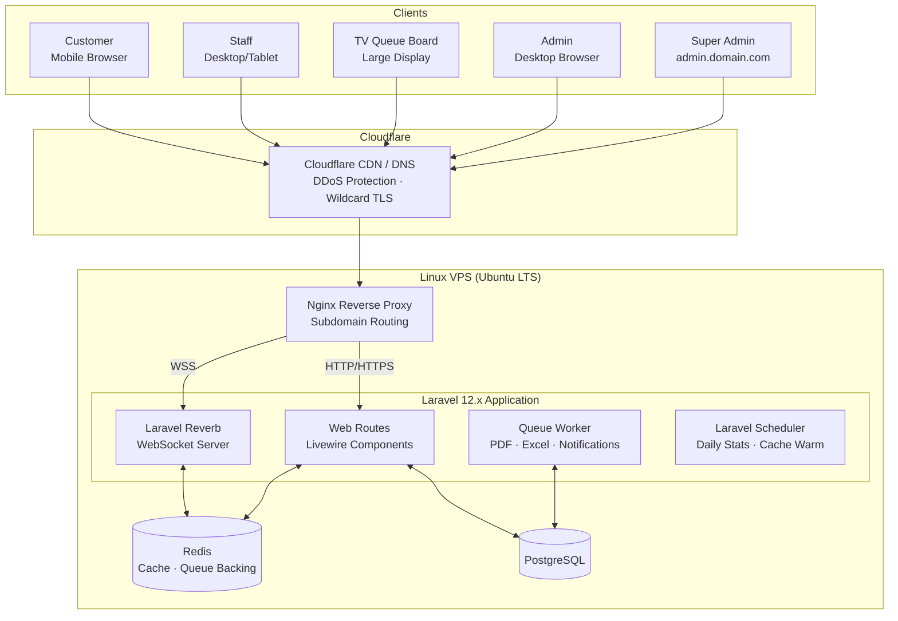
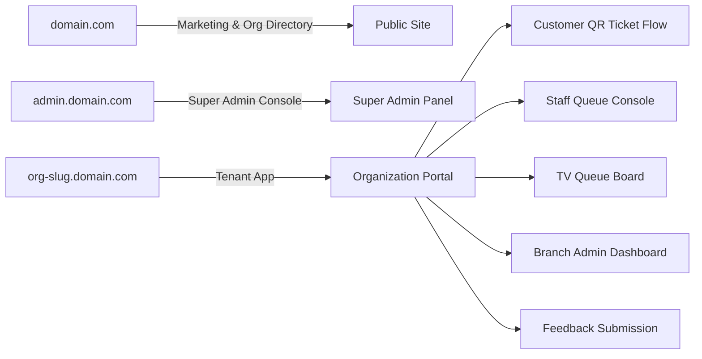
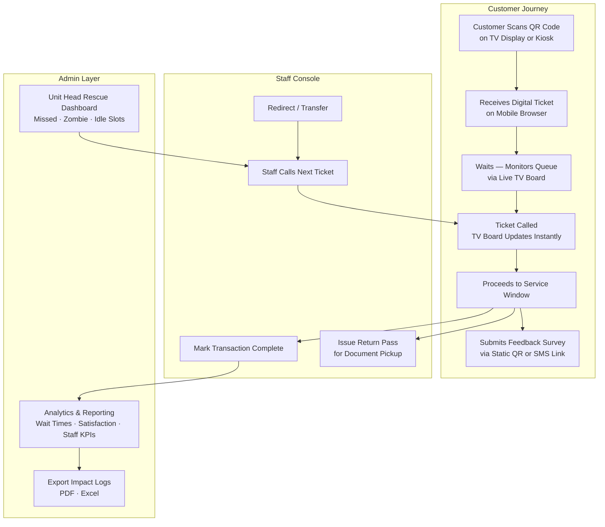
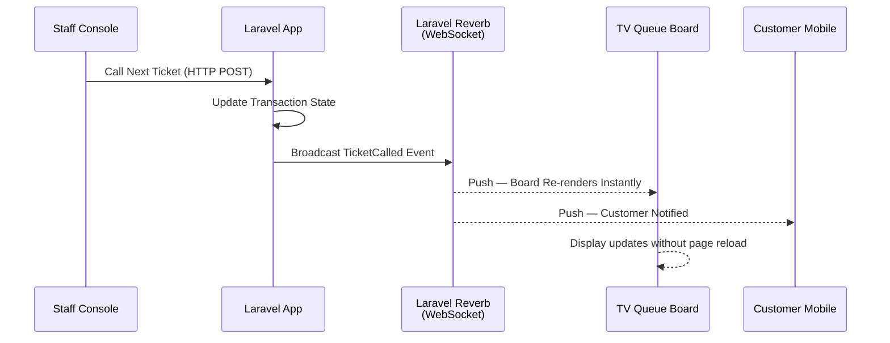
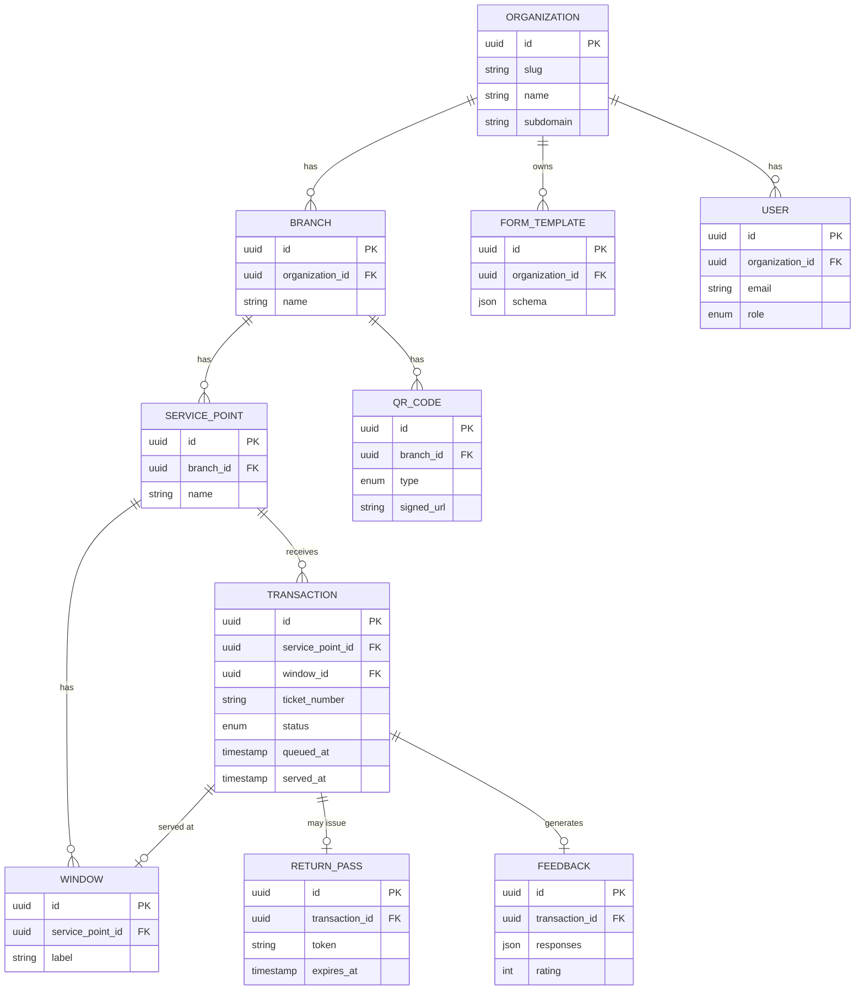

# ScanServe — System Architecture

> A high-level architectural overview of the ScanServe queue management and feedback platform.
> Diagrams are written in Mermaid and render natively on GitHub.

---

## 1. System Overview

ScanServe follows a **multi-tenant monolithic architecture** built on the TALL stack (Tailwind, Alpine, Laravel, Livewire). Each onboarded organization receives an isolated subdomain (`{org}.domain.com`). A wildcard TLS certificate covers all tenant subdomains, so onboarding requires only DNS + database configuration — no per-tenant certificate provisioning.

Real-time features (TV queue boards, live ticket state) are powered by **Laravel Reverb**, a native WebSocket server, removing any dependency on third-party services like Pusher.

---

## 2. Subdomain Routing & Tenant Isolation

---

## 3. Core User Roles & Operational Flow

---

## 4. Real-Time Event Architecture

---

## 5. Entity Relationship (High-Level)

---

## 6. Key Architectural Decisions

| Decision | Rationale |
|---|---|
| **TALL Stack (no decoupled SPA)** | Queue state is server-driven — Livewire keeps the hot path on the server where the source of truth lives. A separate REST API would add an unnecessary serialization layer. |
| **Subdomain-per-tenant** | Hard tenant isolation without separate deployments. Wildcard TLS handles all subdomains automatically. |
| **Laravel Reverb (self-hosted WebSockets)** | Eliminates SaaS dependency on Pusher. Real-time TV board updates require low-latency, persistent connections. |
| **Signed Dynamic QR URLs** | Short-lived signed URLs prevent ticket spoofing. TV displays rotate QR codes at configured intervals. |
| **Append-only Transaction Log** | Transactions are never deleted — soft states (cancelled, abandoned, zombie) are tracked for compliance and audit exports. |

---

© 2026 Mark Anthony Resoso · [Back to project](../README.md) · For portfolio demonstration only.
