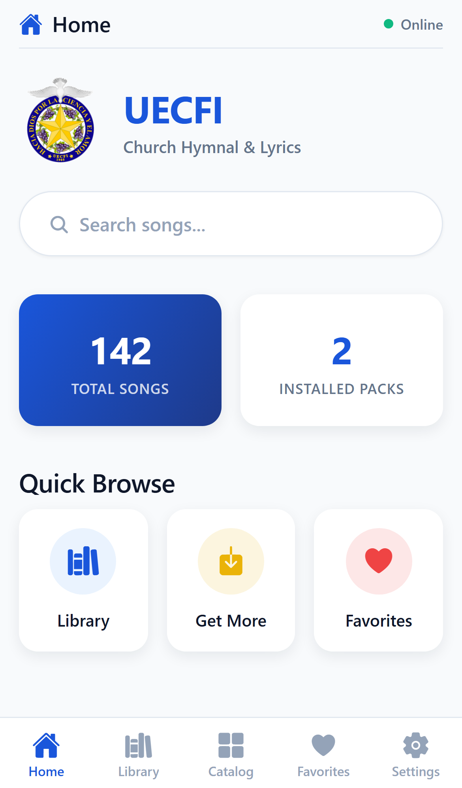

# UECFI

> **Offline-first mobile hymnal and worship companion.**
> Cross-platform digital songbook with dynamic transposition and secure cloud catalog synchronization.

---

## System Overview

**UECFI** is a lightweight, high-performance **mobile application** designed for congregation members, worship teams, and church administrators. It serves as a digital companion that consolidates the official church song catalog into a highly customizable, offline-first reader.

This repository serves as a **high-level system overview**. The proprietary source code, deployment configuration, and internal business logic remain private.

## System Goals

The primary goal of UECFI is to **replace printed songbooks and static PDF binders** with a smart, reactive mobile app. Worship teams often struggle with static chord sheets that don't match the vocalist's pitch key, while congregation members suffer from slow loading speeds and weak internet connection in sanctuary basements. 

By designing an offline-first SQLite repository combined with an in-memory chord transposition engine, UECFI ensures that worship lyrics, structure guides, and musical keys are instantly accessible anywhere, anytime, with zero loading latency.

## Key Features

- **Dynamic Chord Transposition** — In-memory parsing of bracketed chord notations (`[C]`, `[Am]`) with a semitone shift engine, updating the UI dynamically without displacing lyrics alignment.
- **Offline-First SQLite Cache** — Complete local database seed of starter packs, ensuring 100% of hymns, metadata, favorites, and settings function without an active network connection.
- **Admin Cloud Sync** — A secure administrator panel connected to Firebase Firestore that allows content creators to publish new packs, edit lyrics, and push catalog version bumps.
- **Developer Easter Egg** — Hidden dev portal gated by rapid version tapping and Firebase Authentication, allowing authorized admins to manage catalog records directly from their mobile devices.
- **Customizable UI Engine** — Dynamic font resizing, light/dark theme synchronization, and chord-display toggles managed via Zustand for smooth, fluid user adjustments.
- **Hymnal Pack Bundles** — Partitioned song categories and languages (such as Ilocano and English) organized into modular packs that can be installed, uninstalled, or updated.

## Impact & Results

| Metric | Outcome |
|--------|---------|
| **100%** | **Offline availability** — Zero network calls required to load local hymns, ensuring perfect reliability in zero-connectivity environments. |
| **0ms** | **Transposition latency** — Pitch shifting runs entirely client-side using in-memory state mapping for instant key adjustments. |
| **<2s** | **Cloud synchronization** — Authenticated changes made by admins sync down to users immediately upon establishing an internet connection. |

## Operational Flow

1. **For the Congregation** — Browse modular packs (such as *UECFI Songs*), query the active catalog using debounce search across titles, lyrics, and tags, and toggle dark mode for dim sanctuary layouts.
2. **For Worship Leaders** — View chord structures inline with lyrics, adjust the transpose controls to shift keys, and customize font sizes to read comfortably on tablet or mobile music stands.
3. **For Church Admins** — Perform the easter-egg tap gesture in settings, log in via secure credentials, write or update songs, and synchronize modifications to the cloud catalog.

## Documentation

| Document | Description |
|----------|-------------|
| [Case Study](./docs/case-study.md) | Narrative-style write-up: challenge → solution → impact |
| [Engineering Challenges](./docs/challenges.md) | Hard problems encountered and how they were solved |
| [Deployment](./docs/deployment.md) | Infrastructure, build workflows, and Firestore rules |
| [Scalability](./docs/scalability.md) | Database query optimizations and state management scaling |
| [Tech Stack](./tech-stack.md) | Detailed stack breakdown with rationale |

## Visual Artifacts

- [`screenshots/`](./screenshots/) — UI captures: Home, Library, Search, Song Details, Settings, Catalog, and Admin Portal
- [`architecture/`](./architecture/) — System design, synchronization schema, and data flows

---

© 2026 Mark Anthony Resoso · See [LICENSE](../../LICENSE) · This documentation is provided for portfolio demonstration only.
