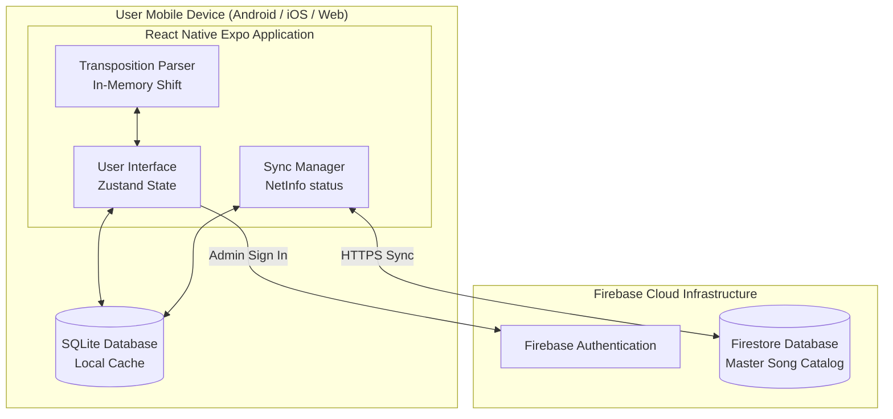
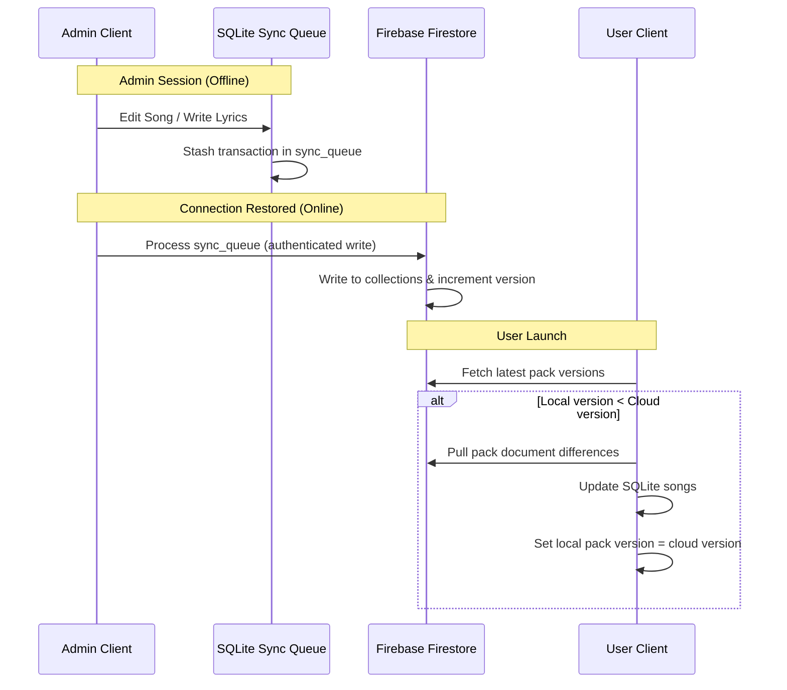
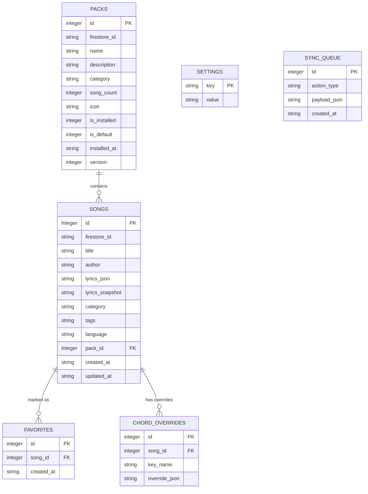

# UECFI — System Architecture

> A high-level architectural overview of the UECFI mobile hymnal application.
> Diagrams are written in Mermaid and render natively on GitHub.

---

## 1. System Topology

UECFI is an offline-first mobile application. The master song database resides in **Firebase Firestore**, while the active catalog is loaded and queried from local **SQLite** databases on the user's mobile device.

---

## 2. Catalog Synchronization Flow

This diagram illustrates how catalog updates are synced from the cloud, and how modifications flow from administrators back up to Firestore:

---

## 3. Entity Relationship Diagram (SQLite Database)

The database schema manages local files, preferences, favorites, and the offline queue:

---

## 4. Key Architectural Decisions

| Decision | Rationale |
|---|---|
| **WASM SQL Fallback for Web** | Enables database migrations and seeds to run in browser tests (Playwright) without stubbing database hooks. |
| **Separation of Lyrics and Chords** | Lyrics are stored in a structured JSON layout, separating musical guides (brackets) from display stanzas. |
| **Session-Only Dev Mode** | Admin mode credentials and access are not persisted on disk. Leaving dev mode clears credentials and destroys temp queues. |
| **SQLite Indexing on Write** | Triggers and indices ensure quick catalog searches on devices with limited CPU performance. |

---

© 2026 Mark Anthony Resoso · [Back to project](../README.md) · For portfolio demonstration only.
